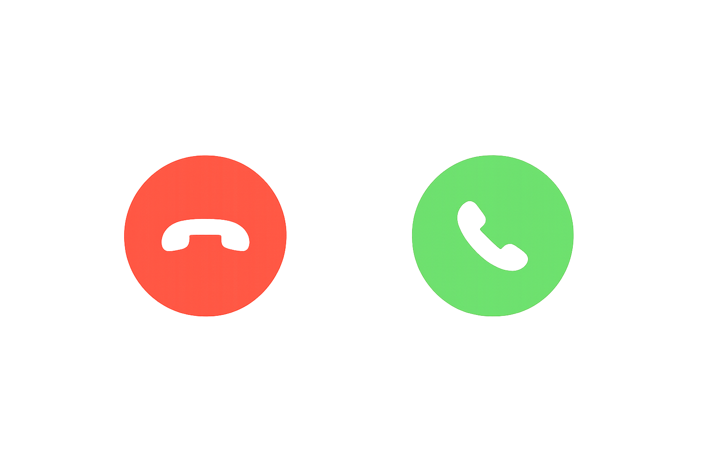
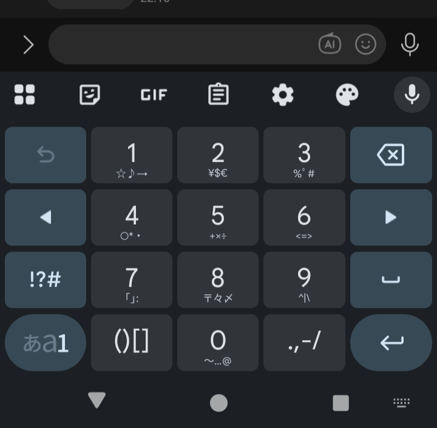

# スマホ講座

---

## スマホ講座

- 講師：青葉スマホ・サポーター
	- （横浜市青葉区区民活動支援センター『活動団体』及び『まち活パートナーズ』登録団体）

- 端末操作等全ての行為及びその結果については、主催者及び講師は、一切の責任を負いかねますのでご了承ください。
- ご契約状況によっては、追加料金（通話、通信など）が発生する場合があります。また、操作内容によってはデータ通信量を消費します。予めご理解のうえ、操作くださいますようお願いいたします。

---

# 第1回：スマホの基本操作

---

## 電源の入れ方
- iPhone：電源＋音量ボタン長押し  
- Android：電源ボタン長押し  
- 電源オフは画面の指示に従う

---

## 操作方法
- タップ  
	- 指で画面を軽く押してすぐに指を離す
- 長押し  
	- 長く押し続ける
- スワイプ  
	- 辞書をめくるような感じ
- ピンチ（拡大・縮小）
	- 指二本を広げる・縮める　

---

## ホーム画面の基本
- アプリ一覧
	- iPhone 左へスワイプでアプリ一覧  
	- Android 下から上へスワイプでアプリ一覧  
- ホーム画面にアプリを追加する方法
	- アプリを長押ししたまま、画面の一番上に移動
- アプリ移動：長押し → ドラッグ

### 起動中アプリとは

- 画面から見えなくなっただけで、まだ動いているアプリのこと
- 別のアプリに移ったときには、前のアプリはまだ動いている

---

## アプリの間の行き来

### iPhone
- 一つ前に戻る
	- 右にスワイプ
- 起動中アプリ一覧
	- ホームボタンなしの機種：　画面の下部から上にスワイプ
	- ホームボタンありの機種: 　ホームボタンをダブルクリック
- アプリをスイッチ
　　	- 起動中アプリ一覧で左右にスワイプしてから、アプリをタップ
- アプリを停止
	- 起動中アプリを上にスワイプ

### Android
- 戻る／ホーム／履歴(起動中アプリ) ボタン

---

## 画面ロック

- スマホにつける鍵です

    - PIN　（４桁の暗証番号）
    - パターンロック　（９個の点をなぞる）
    - 顔認証

- パスキー

    - サービスへのログインと、画面ロックを結びつけ、パスワードの代わりに画面ロックを用いる方法
    
    
---

## その他

- Wi-Fi/モバイル通信の違い
  - Wi-Fi：家や公共の場所で提供されている通信手段
    - SSID/パスワード
    - 扇形のマーク
  - モバイル通信
    - 電話の契約で買ってるもの
    - 「ギガ」を消費します
    
- 「デバイス」：機器のこと。スマホやタブレットのことです

- スマホのシステムや、アプリの「更新」はOKして下さい

- 「設定」：歯車のマークか、三本線マーク

---

# 第2回：電話と連絡先

---

## 電話のかけ方
- 番号入力   
	- キーパッドのマークから

- 連絡先(電話帳)から発信
	- 受話器のマークで発信

- 着信履歴から発信  
	- 着信履歴を押して
	- 受話器のマークで発信
---

## 電話の受け方
- 着信画面で応答  
- 終了は「通話終了」
	- (注意)アプリを終了したつもりでも、起動中なら切ったことにはならない
	- 終了ボタンをちゃんと押しましょう

### 【やってみよう】スピーカーで話してみよう
- 隣の方やスタッフと実際に通話してみましょう。
- 通話中の画面にある「スピーカー（または音声出力）」をタップ。
- **効果**：耳に当てなくても声が大きく聞こえるようになります。

---

## 連絡先の基本
- 名前・番号・メールなどを登録  
	- 最後に保存ボタンを押す
- 編集・削除も簡単  
	- 「編集」：鉛筆のマーク
- 着信履歴から登録可能

---

# 第3回：文字入力

---

## 入力方法

### 音声入力

- マイクを見たら、とにかく喋って！
- マイクはあちこちにあります
  - 文字入力メニューから
  - Google検索窓の右 

### フリック入力
- ボタンを「叩く」のではなく、上下左右に「滑らせる」入力方法です
- **メリット**：何度もボタンを押さなくて済むので、慣れると一番速いです

---

## 【やってみよう】指を動かしてみよう
- **真ん中をポン**：あ
- **左**へ滑らせる：い
- **上**へ滑らせる：う
- **右**へ滑らせる：え
- **下**へ滑らせる：お

> **覚え方のコツ**：中心から「左・上・右・下」の順に「い・う・え・お」と並んでいます。

---

## 文字種類の切り替え
- キーボード左下の **「あ A 1」** ボタンを確認しましょう
- **「あ」**：日本語（ひらがな）
- **「A」**：アルファベット
- **「1」**：数字・記号
- 1回押すごとに、キーボードの種類が切り替わります

### やってみよう

Google検索画面を出して、以下のキーワードを入れてみましょう。
漢字カタカナ英数字混じりの練習です。

- 横浜 ランチ おすすめ 2026
- 健康体操 YouTube 高齢者向け
- LINEの使い方 初心者

---

## 濁点・半濁点・小さい文字
- **ルール**：まず文字を打ってから、左下の **「小 ゛ ゜」** ボタンで変身！
- **「か」** ➔ **「小 ゛ ゜」** を押す ➔ **「が」**
- **「は」** ➔ **「小 ゛ ゜」** を押す ➔ **「ば」** ➔ **「小 ゛ ゜」** を押す ➔ **「ぱ」**  
- **「つ」** ➔ **「小 ゛ ゜」** を押す ➔ **「っ」**

---

## 文字の修正　
- ×で削除  
- 長押しでカーソル移動  
- コピー＆ペースト
	- 長押しでコピー、別の場所でペースト（貼り付け）

---

# 第4回：LINEの基礎知識

---
## LINEを安全に使う

### 友だち自動追加をオフにする
1. ホーム（画面左下）  
2. 歯車アイコン（設定）  
3. 「友だち」を開く  
	- 「友だち自動追加」をオフ  
	- 「友だちへの追加を許可」もオフ

### IDによる友だち追加をオフにする
1. ホーム 
2. 歯車アイコン  
2. 「プライバシー管理」を開く  
3. 「IDによる友だち追加を許可」をオフ  
	- 不特定多数から検索されるのを防ぐ

---

## 友だちの名前を変更する
- LINEは友達の名前がわからなくなりがち。変更しましょう

1. ホーム  
2. 友だちリストから友達をタップ  
3. 名前の横に、小さな鉛筆アイコン  
4. 表示名を変更  
5. 保存  

- 相手には通知されない

---

## QRコードで友だち追加

### 【自分】相手のコードを読み取る
1. ホーム画面またはトーク画面の上にある **「QRコードのマーク」** をタップ。
2. カメラが起動したら、相手のスマホに表示されたコードを枠内に合わせます。
3. 相手のプロフが表示されたら **「追加」** をタップ。

---

### 【相手】自分のコードを表示する
1. 同じく **「QRコードのマーク」** をタップ。
2. 画面の下にある **「マイQRコード」** をタップ。
3. 自分のコードが大きく表示されるので、相手に見せます。

---

### 友だち追加した後の流れ
- **自分側**：すぐに相手とトーク（メッセージ）ができるようになります。
- **相手側**：ホーム画面の「友だち」リストに **「知り合いかも？」** と表示されます。
- **ポイント**：相手も **「追加」** ボタンを押すことで、お互いが「友だち」として登録完了します。

---

## 【やってみよう】隣の人と交換してみよう
※間違えて別の人を追加しないよう、名前を確認しながら行いましょう。

1. 二人組になり、**「読み取る人（カメラ）」** と **「見せる人（コード）」** を決めます。
2. 読み取れたら、役割を交代してみましょう。
3. **確認ワーク**：自分の「友だち」一覧に、今追加した人の名前が出てくるか見てみましょう。

---

## 写真・動画の送信
1. ホーム → 友だち → トーク  
2. メッセージ欄横の画像アイコン  
3. 写真／動画を選択  
4. 複数選択も可能（件数表示）

---

## LINE通話（音声・ビデオ）
### 発信
- トーク画面 → 受話器アイコン  
- 音声通話／ビデオ通話

### 着信
- iPhone：青ボタン  
- Android：緑ボタン  
- 赤ボタンで拒否

---
## LINEのマイク

  - LINEの入力欄の右にあるマイクは留守電のように音声を送るためのものです
  - 文字入力のマイクとダブって紛らわしいことがあります
  
  
  
---

# 第6回：ChatGPTを体験しよう

---

## 音声アシスタントの呼び出し方
- Android：「OK Google」→ Gemini  
- iPhone：「Hey Siri」→ Siri  
- 例：「明日の天気は？」

---

## AIアプリの紹介
- ChatGPT：https://chatgpt.com  
- Copilot：https://copilot.microsoft.com  
- Gemini：https://gemini.google.com/app

---

## アカウント作成の流れ
- アカウント登録すると、会話を覚えておいてくれます。
- アカウント登録の流れの練習を兼ねて試してみましょう

1. 「新規登録」  
2. メール or SNS連携  
3. メール認証  
4. 認証コード入力 or URLタップ

---

## AIとの会話のコツ
- LINEで話すように質問  
- 情報を後から追加してOK  
- 音声入力・写真添付も可能

### AIの答えとの付き合い方
- 間違うこともあります
- お金・健康・手続きは必ず公式確認
- 分からなければ人に聞くのが正解

---

## AIの活用例
- レシピ提案  
- 会話の要約  
- 翻訳  
- 画像認識  
- 「LINEでアルバムを作る方法は？」  
- 「フリーWi-Fiは使うべき？」  
- 「写真をPCに送る方法は？」  

---

# 第7回：カメラと写真整理

---

## カメラの基本
- 前面／背面切替  
- 撮影後すぐ確認  
- ピント合わせはタップ

---

## 写真を見る・削除
- iPhone：写真アプリ  
- Android：フォト／ギャラリー  
- 不要な写真は削除

---

## アルバム作成
- 長押し → 複数選択  
- アルバムに追加  
- タイトルを付ける

---

## 写真を送る
- メール添付  
- LINE  
- SNS

## 写真の削除

- 同じ写真が何枚もある
- ピンボケ
- 何を撮ったか分からない写真

### 【やってみよう】
- いらない写真を5枚だけ削除してみましょう
- 長押し → 複数選択 → ゴミ箱へ

---

# 第8回：地図アプリ

---

## Googleマップの基本
- 現在地表示  
- 経路案内（徒歩／車／電車）  
- 周辺検索  
- ストリートビュー

---

# 第9回：困ったときの相談室 ＆ スマホの整理整頓

---

## 困ったときに最初にやる「3つのステップ」
※ ほとんどのトラブルは、これで解決します。

1. **画面をよく見る**
   - 「×」「戻る」「キャンセル」が隠れていませんか？
2. **「戻る」か「閉じる」**
   - 画面を左からなぞるか、アプリを上にシュッと飛ばして閉じます。
3. **分からなければ「止まる」**
   - 変なボタンを押さず、そのまま講師や家族に見せましょう。

> ⚠ 電源オフ・再起動は、これらがダメだった時の「最後の手段」です。

---

## よくある「困った！」への処方箋

### ① 音が出ない
- 横のボタンで音量を上げる。
- 「マナーモード（消音）」のスイッチが入っていませんか？

### ② 画面が大きすぎる／小さすぎる
- 指2本で広げる（拡大）、つまむ（縮小）。
- **合言葉**：「壊れた」ではなく「表示が変わった」だけ！

### ③ 戻れなくなった
- 「ホームボタン（下からスワイプ）」で一度リセットしましょう。

---

## 【重要】変な警告画面が出たら？
「ウイルスに感染」「今すぐ電話して」など、大きな音が鳴ることもあります。

- **絶対にしないこと**：押さない、電話しない、アプリを入れない。
- **すること**：ブラウザの「タブ（窓）」を閉じるだけ。
- **安心してください**：画面が出ただけで、まだ何も起きていません。

---

## スマホの整理整頓：考え方
スマホは **「机の上」** と同じです。
- よく使うものは「手前（ホーム画面）」に。
- 使わないものは「引き出し（フォルダ）」に。
- いらないものは「捨てる（削除）」。

---

## 整理整頓

### アプリを動かす
- アプリを長押し ➔ 指を離さずに好きな場所へ動かす。

### アプリを消す
- 1年以上使っていない、入れた覚えがないアプリは消してOK。
- **安心ポイント**：消しても、また入れ直せます。

### 写真・動画の整理
- スマホが重くなる原因の1番は「写真と動画」です。
- 似たような写真や、ピンぼけ写真は思い切って削除しましょう。

---

## 通知をスッキリさせる
「ピコンピコン」鳴り止まないお知らせを整理します。

- **残すもの**：電話、LINE、家族からの連絡。
- **止めるもの**：ニュース、宣伝、よく分からないお知らせ。
- **ポイント**：通知が減るだけで、電池の持ちも良くなります。

---

# 第10回：スマホの超基本復習

---

## 電話のかけ方
- **電話番号を入力してかける**：電話➔ キーパッド ➔ 番号入力 ➔ 受話器アイコン
- **着信履歴からかける**：電話 ➔ 通話履歴 ➔ かけたい相手の受話器アイコン
- **連絡先からかける**：連絡先（電話帳） ➔ 名前を選択 ➔ 受話器アイコン
- **電話を切る**：通話終了（受話器）ボタンを押す

---

## 電話帳とメッセージ
- **SMS（ショートメッセージ）**：電話番号を宛先にして短い文章を送る機能
- 連絡先アプリから、直接メッセージやメールの送信画面へ移ることができます
- 自分のスマホに届いているメッセージやメールを、アプリを開いて確認してみましょう

---

## 【やってみよう】自分にメッセージを送ってみよう
- 宛先に「自分の電話番号」を入力します。
- 本文に「練習」と打って送信ボタン（紙飛行機マーク）をタップ。
- **ポイント**：すぐに自分に届きます。これで送信と受信の両方の練習ができます。

---
## QRコードの読み取り方
1. カメラアプリを起動し、QRコードを画面に映す（シャッターボタンは押さない）
2. 画面上に表示された文字やURL（アドレス）をタップ
3. 目的のウェブページや情報画面に移動します

---

## ログイン・登録とは
- **個人登録**をすることで、インターネット上に自分専用のカウンター（口座）が用意されます
- **ID**：自分の名前やメールアドレスなど、自分を識別するもの
- **パスワード**：自分だけの「鍵」。名前や誕生日は避け、アルファベットと数字を混ぜたものを設定し、必ずメモして保管しましょう

---

## 登録の手順と本人確認

- IDを決める（自分の名前）
  - メールアドレスを使う場合もあります
- パスワードを決める（自分だけの鍵）
  - 名前や誕生日は避け、アルファベットと数字を混ぜた「合図」を決めます。
  - ポイント： 忘れないようにメモをして、誰にも見せない場所に保管しましょう。
- 本人確認
  - SMS（ショートメッセージ）を受け取って確認とすることが多いです。
  - 登録ボタンを押すと、あなたの携帯電話に「4桁〜6桁の数字」が届きます。
  - ポイント： これはその時だけ使える「一度きりの合図」です。
届いた数字を入力する
  - 画面の指示に従って、届いた数字を打ち込めば登録完了です！

---

## 【やってみよう】自分の「ID」を確認しよう
- **iPhone**：設定 ➔ 一番上の「自分の名前」 ➔ その下に書かれたメールアドレスを確認
- **Android**：設定 ➔ Google ➔ 名前の下に書かれたメールアドレスを確認
- **確認**：これがインターネット上の「自分の名札」になります。

---

## パスワードの確認方法
忘れてしまった場合や確認したい場合は、以下の設定から見ることができます。

- **Android**：「設定」 ➔ 「Google」 ➔ 「自動入力」➔ 「Google パスワード マネージャー」
  - 「パスワードとアカウント」という名前かも
  - **Samsung（Galaxy）の方**：設定 ➔ 「一般管理」 ➔ 「パスワードと自動入力」の中にあります。
- **iPhone**：「設定」 ➔ 「パスワード」

### メモとの照合
- 確認のポイント
  - 以前登録した「LINE」や「dポイント」「Amazon」などが出てきますか？
    - 項目を一つタップして、中身を見てみましょう。
    - 伏せ字「●●●」となっている横の「目のマーク」を押すと、実際のパスワードが見えます。

- お手元のメモに書いている内容と、スマホの中身は合っていますか？

---

## 迷惑メール対策
- **不要な宣伝メール**：メールの末尾にある「配信停止」や「購読解除」から解除できます
  - 楽天など、信用できるメールの場合はこれでOK
  
- **不審なメール**：開かずに「迷惑メール報告」や「ブロック」機能を活用しましょう
  - 例
    - 「荷物をお預かりしています。こちらのURLを確認してください」
    - 「未納料金があります。本日中に支払わないと裁判になります」
  - この場合、配信停止のリンクは無視して下さい。逆に個人情報が取られます

---

## Gmailでメール
- 宛先 → 件名 → 本文 → 送信  
- 画像添付  
- 受信画像の保存

---

# 第11回：インターネット検索を使いこなそう

---

## 検索の基本
- ブラウザ：ネットの情報を取るためのアプリ
	- Chrome（クローム）
	- Googleアプリ
	- Safari

- キーワード入力  
- 音声検索  
- Googleレンズ

---

## 検索は「公式」を探す場所
- AIの答え：インターネットの情報をまとめた「便利なヒント」
- 検索するべき事：予約方法、確かな情報の確認
- 検索結果：その場所やお店が書いた「本物の情報」
- **使い分けのコツ**：大事なことは、必ず自分の目で「公式」を確認しましょう。

---

## 【やってみよう】「公式」を見分ける
青葉区役所の時間を調べて、どれが「本物」か探してみましょう。

1. マイクに向かって「青葉区役所　窓口　時間」と言う。
2. 検索結果を少し下に動かす（スクロール）。
3. **yokohama.lg.jp** という文字や、横浜市のマークがついたリンクを探す。
- **ポイント**：これが役所の「公式サイト」です。
- **URL**とは：**https://www.city.yokohama.lg.jp/** のように **https://** で始まる文字列

---

## 広告に注意！
検索結果の一番上には、たまに **「広告」** や **「スポンサー」** と出ることがあります。

- 広告は、宣伝のためにお金を出して上に表示させているものです。
- 役所や公共の情報を探しているときは、広告を飛ばして「その下」にある本物の情報を探しましょう。

---

## 生活を便利にする検索ワーク
声だけで、以下のことを調べてみましょう。

- **「明日の青葉区の天気」**
  - 折りたたみ傘が必要か分かります。
- **「たまプラーザ駅　時刻表」**（最寄り駅など）
  - 電車の時間をすぐに確認できます。
- **「大根　レシピ　簡単」**
  - 今日の夕飯のヒントが画像付きで出てきます。

---

## 【重要】見終わったら「タブ」を閉じる
ページをたくさん開くと、スマホが疲れて動きが遅くなります。

1. 画面下の **「□」** や **「数字」** のマークを押す。
2. 今まで見たページが重なって出てきます。
3. **「すべて閉じる」** または **「×」** でお掃除しましょう。
- **合言葉**：使い終わったら「窓」を閉める！

---

## 撮った写真から検索する

- Googleレンズを押します
- フォト ギャラリーを開く
- 検索したい画像を選択
- 選択した画像に近い検索結果が表示されます

---

# 第12回：音楽・ラジオ・動画

---

## ラジオ・ポッドキャスト・動画

- 番組を「登録（フォロー）」すると、更新のお知らせが来ます

### ラジオ

- radiko  
- NHKらじる★らじる  

### ポッドキャスト
- 番組の音声配信
- ポッドキャストアプリ（Podcast, Spotify）

## 動画
- YouTube
- TikTok

	 
---

## 音楽サービス
- YouTube Music  
- Spotify  
- Apple Music  
- Amazon Music

---

